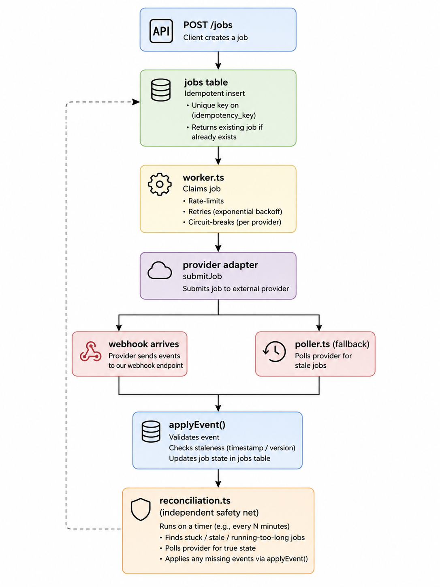

# AI Job Orchestrator

A backend service for submitting, tracking, and reconciling asynchronous
AI provider jobs (image/video/audio generation) — built to demonstrate
the operational concerns that actually matter once an AI feature is in
production: duplicate requests, provider outages, dropped webhooks,
out-of-order events, and rate limits.

This is not an "AI wrapper." No part of this system calls an LLM to do
its job. AI providers (Replicate, ElevenLabs — faked here for a
zero-API-key demo) are just the async workload being managed.

## The problems this solves

| Problem | Where it's handled |
|---|---|
| Client retries a request — must not double-charge or double-submit | `POST /jobs`, unique `idempotency_key` constraint |
| Two worker processes must never grab the same job | `worker.ts`, `SELECT ... FOR UPDATE SKIP LOCKED` |
| Provider call fails transiently (timeout, 429) | `providers/retry.ts`, exponential backoff + jitter |
| Provider is fully down — stop hammering it | `providers/circuitBreaker.ts`, per-provider breaker |
| Provider proactively rate-limits us | `rateLimiter.ts`, token bucket per provider |
| Webhook delivered twice | `webhook_events` table, `UNIQUE(provider, provider_event_id)` |
| Webhook arrives out of order | `webhooks/applyEvent.ts`, status-rank comparison |
| Webhook never arrives at all | `poller.ts`, sweeps stale `processing` jobs |
| Poller *also* misses it, or job never gets picked up by a worker | `reconciliation.ts`, independent sweep + alerting |

## Architecture


    


Webhook handling, polling, and reconciliation all funnel through the
same `applyEvent()` function — so "duplicate" and "out of order" are
handled in exactly one place, not reimplemented three times.

## Running it

Requires Postgres running locally.

```bash
npm install
npm run migrate
```

Four processes, four terminals:
```bash
npm run dev        # API — POST /jobs, GET /jobs/:id, POST /webhooks/:provider
npm run worker      # claims + submits pending jobs
npm run poller       # sweeps stale "processing" jobs
npm run reconcile    # independent safety-net sweep
```

Run tests:
```bash
npm test
```

## Demoing the interesting parts

**Idempotency** — submit the same `idempotency_key` twice, get the same
job back both times, no duplicate row:
```bash
curl -X POST localhost:3000/jobs -H "Content-Type: application/json" \
  -d '{"idempotency_key":"demo-1","provider":"replicate","input":{"prompt":"a cat"}}'
```

**Circuit breaker** — submit ~20 jobs quickly; watch the worker log open
the breaker after consecutive provider failures, then recover after the
cooldown.

**Duplicate / out-of-order webhooks** — see `scripts/sendFakeWebhook.ts`,
demonstrated in the walkthrough video.

**Reconciliation catching a drift** — kill the poller mid-job, wait, then
run `npm run reconcile` — it independently detects and resolves the
stuck job.

## What's intentionally faked, and why

The two provider adapters (`fakeReplicate`, `fakeElevenLabs`) simulate
timeouts, rate limits, and delayed completion instead of calling real
paid APIs. This keeps the demo runnable with zero API keys while
preserving every failure mode that matters — the `ProviderAdapter`
interface is the seam where a real adapter would swap in with no
changes anywhere else in the system.

## Tech stack

Node.js, TypeScript, Express, PostgreSQL, Zod, Vitest.